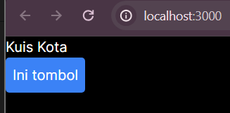
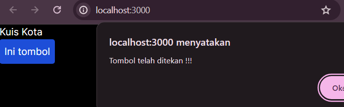
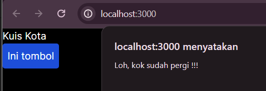
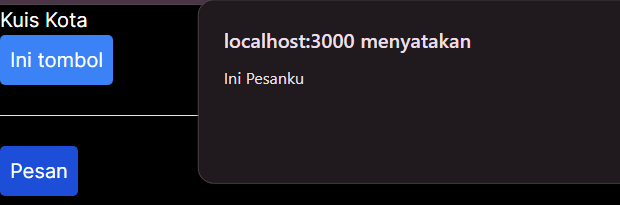
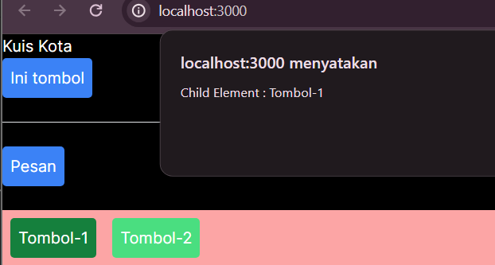
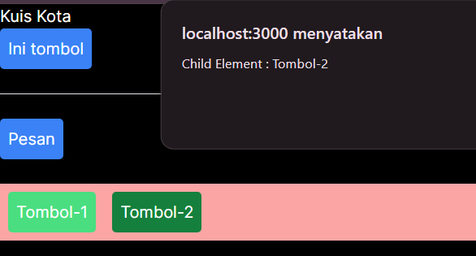
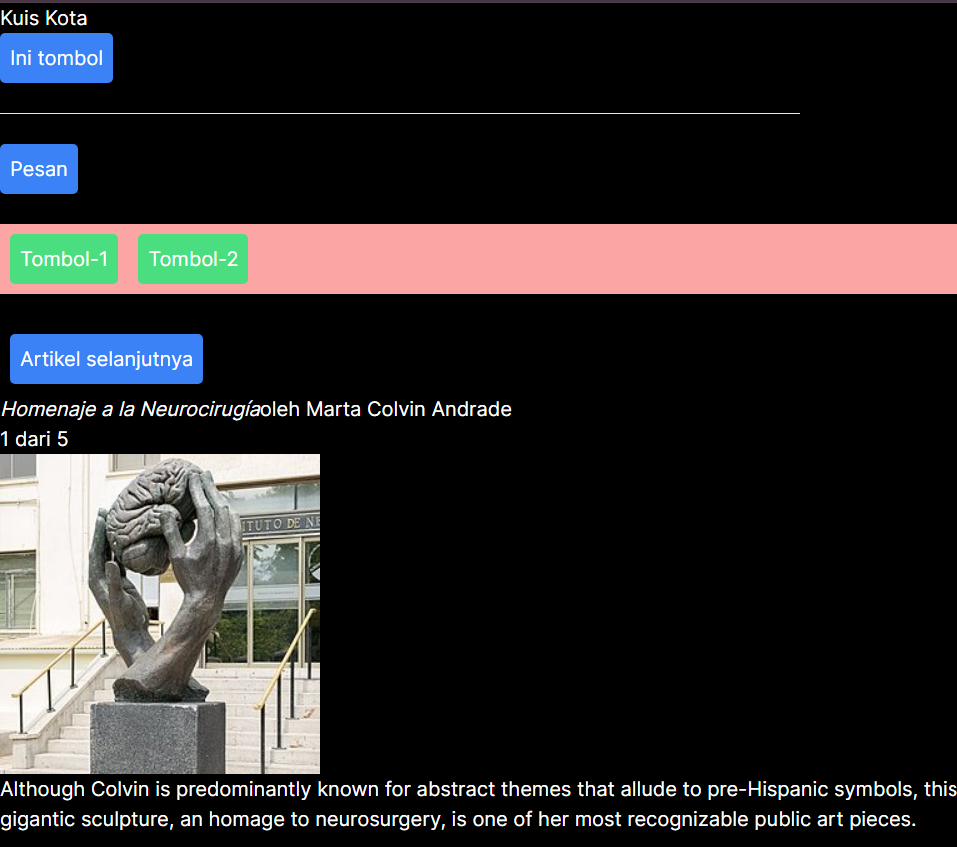
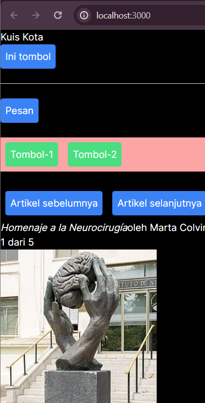

## Laporan Praktikum - 05

|       | Pemrograman Berbasis Framework 2024 |
| ----- | ----------------------------------- |
| NIM   | 2141720222                          |
| Nama  | Diwa Arsyad Atthoriq                |
| Kelas | TI - 3A                             |

### Praktikum 1 : Event Handler

Langkah 1

Langkah 2

### Praktikum 2

### Praktikum 3

Langkah 1 - Propagation

Langkah 2 - Stop Propagation

### Praktikum 4

Langkah 1

Langkah 2: Menambahkan variabel state

# Soal

Jika kita menekan tombol "Artikel Selanjutnya" sebanyak 5x (atau melebihi halaman total artikel), apa yang akan terjadi?

Modifikasilah gallery.tsx agar bisa meng-handle permasalahan tersebut.

Tambahkan tombol "Artikel Sebelumnya", untuk menampilkan artikel secara mundur.
Silahkan laporkan dan commit dengan judul Jawaban Soal Praktikum 4

# Jawaban Soal Praktikum 4

1. Karena index melebihi sculptureLength yang berjumlah 5. Maka jika melebih 5 akan menghasilkan output undefined

2. Saya menambahkan operator modulus + sculptureLength untuk mengembalikan indeks pertama.

3. 
